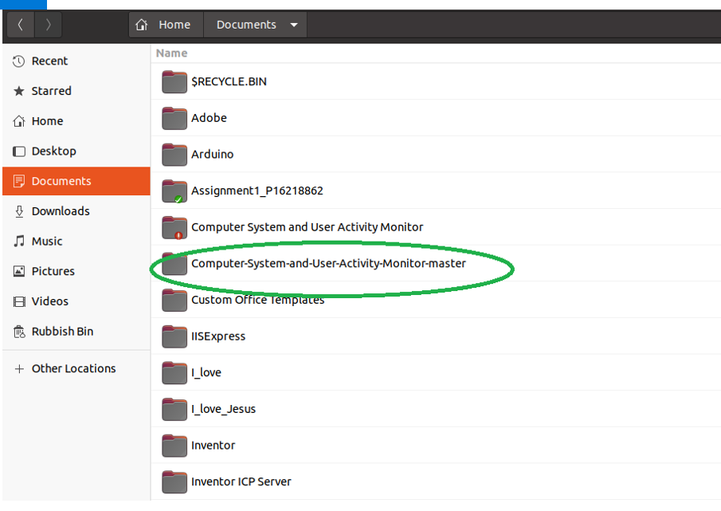
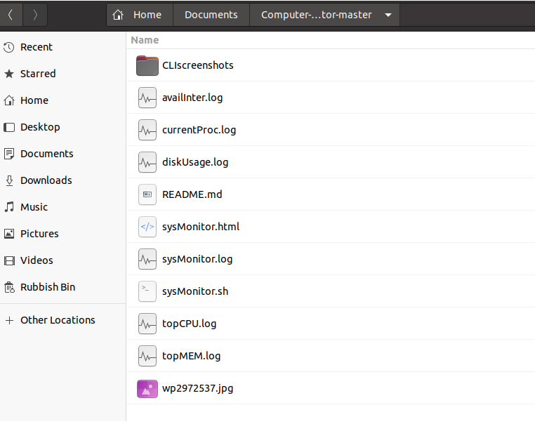
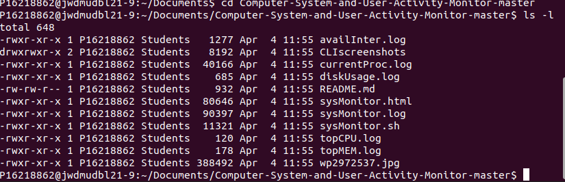
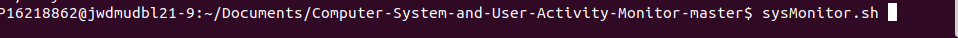
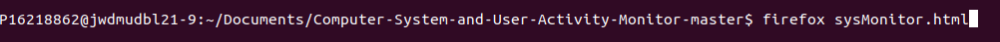
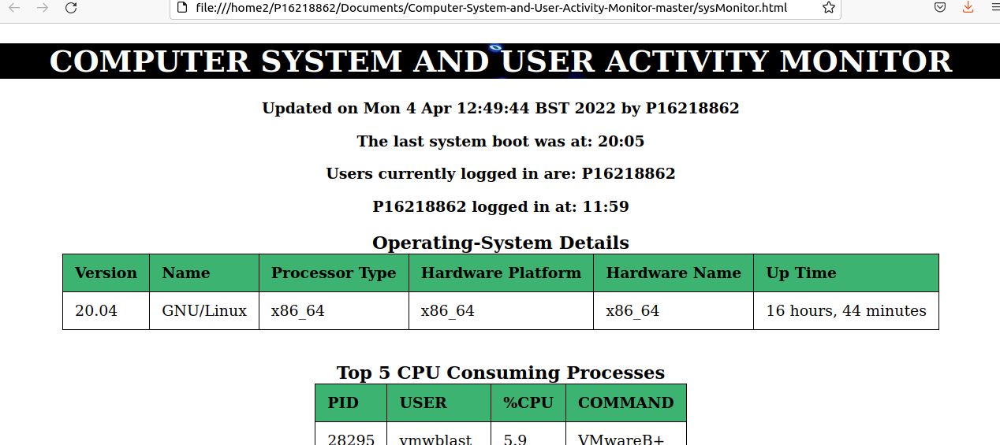
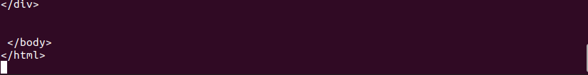

# INTRODUCTION
The first assignment for Computer Systems and Networks module presents student with the opportunity to take on a role of an IT Support Engineer, who was given a task to create a script that monitors key details of the computer system such as CPU utilizations or disk usage and provides these in a reader friendly format in a log and html files .

**NOTE:** The main code is in the **sysMonitor.sh** file 

## HOW TO INSTAL THE SCRIPT 
**Step1.** Download the zip file **“Computer-System-and-User-Activity-Monitor”**.

**This zip folder** should contain: (The files listed down below must be there, otherwise the script won't work. There will be additional files such as README.md, but don't worry about those)

**Three Main files:**\
a)	sysMonitor.sh\
b)	sysMonitor.log\
c)	sysMonitor.html\

**Sub-files:**\
a)	diskUsage.log\
b)	topCPU.log\
c)	availInter.log\
d)	currentProc.log\
e)	topMEM.log\
f)	wp2972537.jpg

**Step2.** Extract the zip folder into the “Documents” folder on your Linux OS.

**Step3.** Now you should have “Computer-System-and-User-Activity-Monitor-master” folder in “Documents”. This should look something like this:

.

.

As shown above, all of the files should be in the folder when you click on it. 

**Important** If you don't have "master" at the end like shown above, then you just have to rename your folder to "Computer-System-and-User-Activity-Monitor-master", so that "master" is a part of the name. 

**Step4.** The above steps are extremely IMPORTANT for the script to run successfully. The reason for that is that  the code in the sysMonitor.sh file uses “ home/Documents/Computer-System-and-User-Activity-Monitor-master/” directory to locate the data that is placed in this folder. If the files don’t work ( i.e. don’t execute – this might be the first place worth checking!).

**Step5.** Open the terminal and from your home directory navigate to the “Computer-System-and-User-Activity-Monitor-master” by typing:

**cd Documents/Computer-System-and-User-Activity-Monitor-master**

And to ensure you have full access to all the files type:\
**ls -l**

Now you should be able to see all of the permissions for individual files. This should look something like this: 

.
 
If the permissions don’t look like this. You have to give permissions to the files by:\ 
**chmod 777 (filename)  OR chmod 770 Or chmod 750 or chmod 700**

Basically any combination that will allow you as a user to execute, read and write to the script, so the first 7 is necessary. 

**Step6.** Now you can read, write and execute the files. 

**Step7.**  After completing all of the steps above it’s finally time to execute the sysMonitor.sh file. You can do this by typing “sysMonitor.sh” in the terminal. Remember that your present working directory should be “Computer-System-and-User-Activity-monitor”. 

**Step8.** After executing sysMonitor.sh file you can open a **HTML REPORT** (**sysMonitor.html**) and a **LOG FILE** (**sysMonitor.log**) by typing:

**firefox sysMonitor.html OR sensible-browser sysMonitor.html** 

 

Now you would be able to see:

 

You can open  a log file by:\
**gedit sysMonitor.log**

You can open a bash script by:\
**gedit sysMonitor.sh**

**Additional Step:**\
**Step9.** To see what sub-files contain open them with “gedit” command. 

Important Note: Sometimes after executing sysMonitor.sh file the terminal doesn’t go back to the “pwd” as seen below:

At this point all of the changes to the files’ output are made, but the present working directory is not displayed. Unfortunately I do not know what is the cause of this yet. To be able to display the “pwd” click: ctrl + c. 

